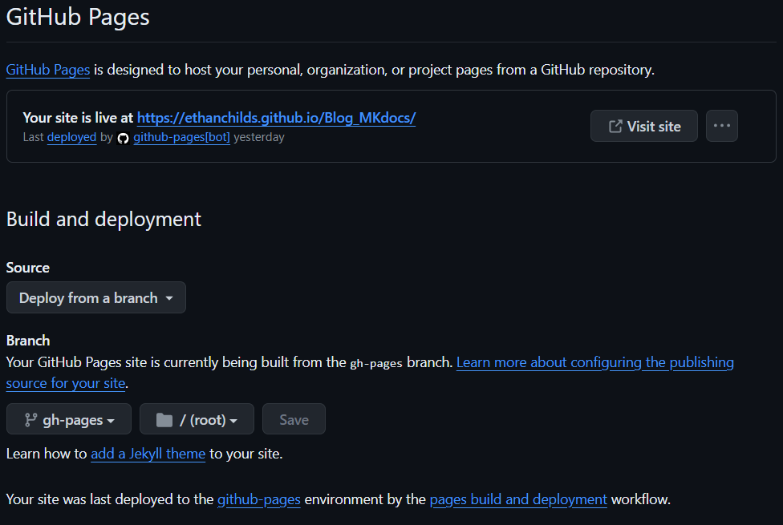

# Deploying to GitHub Pages

## GitHub Actions

Unfortunately, deploying MkDocs to GitHub pages is not as simple as having the full project in your repository. In order to handle the way GitHub actions deals with deployments we will be including a new file. 

First, within your projects directory, create a folder titled '.github'. Next, within the folder create another folder titled 'workflows'. Finally, within this folder create the file 'ci.yml'. Paste the following contents within the file:

```
name: ci 
on:
  push:
    branches:
      - master 
      - main
permissions:
  contents: write
jobs:
  deploy:
    runs-on: ubuntu-latest
    steps:
      - uses: actions/checkout@v3
      - uses: actions/setup-python@v4
        with:
          python-version: 3.x
      - uses: actions/cache@v2
        with:
          key: ${{ github.ref }}
          path: .cache
      - run: pip install mkdocs-material
      - run: pip install pillow cairosvg
      - run: mkdocs gh-deploy --force
```

With this file you can deploy your website hosted on GitHub pages and when you push your changes GitHub actions will know how to respond.

## Setting up GitHub Pages

First, go to your repository settings. On the side bar of this page you will notice a tab called 'pages', click on this. Under "**Build and deployment**" have "Source" set to "Deploy from a branch" and "Branch" set to "gh-pages". If the ci.yml has not been included in the project "gh-pages" will not be an option at this stage. Finally save your preferences and after a minute your pages tab should appear as follows:



The link at the top of your pages tab will be the link to your new GitHub pages website.